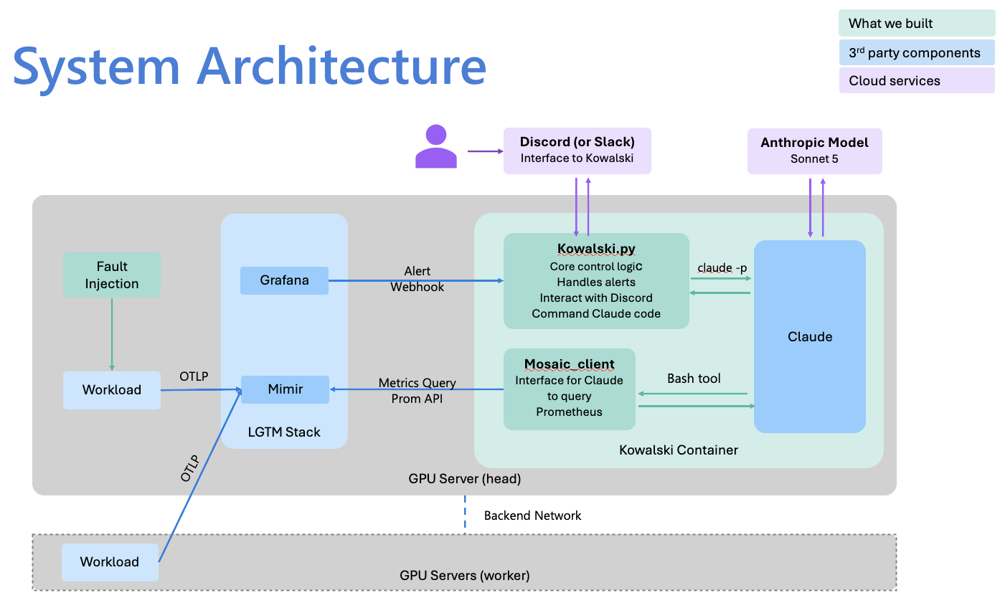

<!--
SPDX-FileCopyrightText: 2025 Delos Data Inc
SPDX-License-Identifier: Apache-2.0
-->

# Mosaic Fault Detective

An agent skill that diagnoses cluster faults from profiler metrics. Kowalski[^1] is the bot
that runs it.

A Grafana alert fires, Kowalski invokes Claude Code headlessly against the skill, the agent
investigates through a fixed set of read-only scripts, and the diagnosis lands in chat.
Nobody is in the loop.

[^1]: Named after the analyst penguin from the *Madagascar* films, whose catchphrase is
    "Kowalski, analysis!" That is also the phrase that triggers the skill.

Three layers, deliberately kept apart. Detection is deterministic: Grafana rules decide
something is wrong. Diagnosis is agentic: Claude decides what to look at and what it means.
Perception is fixed: the agent sees the cluster only through scripts you wrote and tested.



## How it works

### The loop

| Stage | Component |
|---|---|
| Alert evaluates and fires | Grafana alert rule |
| Alert delivered as a webhook | Grafana contact point |
| Mode and cooldown checked | `kowalski.py` HTTP receiver |
| Agent invoked headlessly | `claude -p` subprocess |
| Skill loaded, investigation planned | Claude Code with the `mosaic-detective` skill |
| Metrics queried | Scripts in `scripts/`, via `mosaic_queries.py` |
| Diagnosis posted | `kowalski.py` chat client |

Everything from the receiver down runs in one container on the head node. An injected fault
reaches a posted diagnosis in about two minutes, most of it alert evaluation rather than
inference.

### Grafana alert rules

Three rules: throughput degradation, GPU clock divergence, and collector loss. Each compares
the cluster against its own recent history rather than a fixed threshold, so they move
between clusters with different hardware. [Grafana Alerting](alerting.md) has the
expressions and how to calibrate them.

### `kowalski.py`

One process running the chat bot and the HTTP receiver, sharing an in-memory mode flag:
`ARMED` diagnoses and posts, `NOTIFY` posts the raw alert only, `DISARMED` ignores. The flag
resets whenever the container restarts.

The rest is defensive. Repeat invocations for the same fault are suppressed for three
minutes. A diagnosis takes around ninety seconds, so it runs on a daemon thread and the
handler returns immediately, otherwise Grafana times out and retries. Resolved alerts are
dropped. Long reports are split at newlines rather than cut at the character limit, which
silently truncated every autonomous report until it was fixed.

### The skill

A Claude Code Agent Skill loaded as a unit: `SKILL.md` with the trigger and the diagnostic
procedure, alongside `fault-signatures.md` and `metrics-reference.md`.

Those files are not documentation about what the agent does. They are what it does. A wrong
sentence in one of them is a bug, and it shows up as a confident wrong diagnosis rather than
an error. Most of [Best practices](#best-practices) follows from that.

The skill runs from its installed location, not the repository. `sync-skill.sh` copies it
into place, and an unsynced edit has not taken effect.

### Wrapper scripts

The agent does not write queries. It picks among four read-only scripts in `scripts/`:

| Script | Question it answers |
|---|---|
| `check_collector_health.py` | Is the observability pipeline itself up? |
| `list_metrics.py` | What metrics exist, and which are trusted? |
| `metric_timeline.py` | How has one metric moved over a window? |
| `compare_ranks.py` | Do the ranks or links differ from each other? |

`metric_timeline.py` scans for rate-of-change transitions, catching both a frozen counter
and a gauge stepping down. `compare_ranks.py` groups by rank or link, comparing means for
gauges and deltas for counters.

### `mosaic_queries.py`

Connections, query construction, typed results, and the metric names the wrappers use held
as constants. The Metric Reference in [Profiler Design](design.md) covers what each metric
measures.

No diagnostic logic lives here. Judgment sits a layer up, in the wrappers and the skill's
reference files. The two are verified differently, plumbing by unit tests and judgment
against injected faults, and mixing them makes it hard to tell whether a bad diagnosis came
from a bad query or a bad inference.

## Design decisions

### Guided, not caged

The agent picks the investigative move. It does not pick the metric, which is fixed inside
each wrapper in tested code. A doctor ordering a blood panel does not get to redefine what
the blood panel measures.

This is not settled. On one kill-rank run the agent went outside the wrappers to query
process counts, checking whether the processes had actually exited. It was right, and the
diagnosis was better for it. Wrappers-only is safe but blind to anything you did not
anticipate; open query access is more capable and can fabricate. The current position favors
safety and leaves the boundary open.

### Detection deterministic, diagnosis agentic

Alert rules are cheap, fast and predictable, and run continuously. Agent invocations are
none of those. The deterministic gate means the expensive part only runs once something
simple has established there is a reason to look.

It also keeps the [Fault Playbook](fault-playbook.md) useful on its own. A human with the
playbook and no agent reaches the same answers.

### Fault injection stays outside

The injection harness is not packaged with the detective, and the detective has no write
path to the cluster. Every script it can run is a query.

### Services are reached by name

The container joins the profiler stack's Docker network, so Grafana reaches it by container
name and it reaches Prometheus by container name. No addresses in runtime configuration.

## Limitations

- Discord is the only chat platform currently supported. Slack support is planned; see
  [Extending to another chat platform](#extending-to-another-chat-platform).
- Some faults cannot be localized, and the skill says so rather than guessing. A network
  fault cannot be pinned to a node on a bulk-synchronous ring, and a killed rank cannot be
  identified at typical scrape resolution because the abort propagates within one scrape
  interval. The [Fault Playbook](fault-playbook.md) covers why.
- Combination faults are untested. With the collector down it should report that it cannot
  see the cluster and stop, but that has not been exercised.
- Signatures are calibrated to one cluster. The method transfers to other hardware, the
  numbers do not. See [Calibrate before you trust it](#calibrate-before-you-trust-it).

## Deployment

The mechanical steps take under an hour. Calibration takes longer, and it decides whether
the system produces anything useful.

### Before you start

You need a running profiler stack with Prometheus scraping, and a workload actually running.
The detective diagnoses a live system, so with nothing running every check reads as a fault.

You also need Docker on the node that will host it, which should be the head node so the
system does not depend on your laptop being open. Plus a Discord server you can add a bot
and a webhook to, a Claude plan that supports headless use (Pro, Max, Team or Enterprise),
and outbound network access to the Claude API and to Discord.

### Configure

Everything runs from `tests/mosaic-detective/`.

```bash
cp .env.local.example .env.local
```

| Variable | What it is |
|---|---|
| `DISCORD_BOT_TOKEN` | Bot token, for the interactive chat commands |
| `DISCORD_WEBHOOK` | Webhook URL, for posting diagnoses |
| `PROMETHEUS_HOST` | Overridden by compose when running in the container |
| `PROMETHEUS_PORT` | As above |
| `CLAUDE_CODE_OAUTH_TOKEN` | Headless authentication for Claude Code |
| `TZ` | Timezone for timestamps in reports |

The file is gitignored and holds live credentials. Keep it that way.

For the Claude token, interactive login does not work in a container and a Keychain session
cannot be copied into Linux. Instead:

```bash
claude setup-token
```

That opens the same browser flow as `/login` and prints a token valid for one year. It is
not saved anywhere, so copy it straight into `.env.local`.

Write the expiry somewhere a human will see it. When the token lapses, `claude -p` fails
silently: alerts keep arriving, diagnoses keep not appearing, and nothing in the symptoms
points at authentication.

### Calibrate

`fault-signatures.md` contains a healthy per-rank throughput figure measured on the
reference cluster. Replace it with yours.

With your normal workload running and no faults injected, take a five minute average:

```promql
rate(nccl_profiler_collective_bytes_total[5m])
```

Divide by 1e6 for MB/s per rank, and put that number in `fault-signatures.md`. That is the
whole required step.

If you want to go further, the useful additions are healthy GPU clock ranges and a note of
any recurring oscillation in steady state. The reference cluster swings by about a third
between two values in normal operation, a batching artifact of the collective, and the agent
needs telling that this is expected or it reports it. Your cluster will have its own.

### Build and run

```bash
docker compose up -d --build
```

The compose file joins the container to the profiler stack's Docker network and sets
`restart: unless-stopped`, so the system survives a host reboot.

You should see a boot greeting in Discord. If not, check the container logs before going
further.

### Set up alerting

Follow [Grafana Alerting](alerting.md) to build the three rules, then create a webhook
contact point pointing at the container by name on port 8500. Use the **Test** button to
confirm Grafana can reach the receiver without waiting for a real fault.

### Verify end to end

Work up in stages, because each one isolates a different failure.

| Step | What it proves |
|---|---|
| Boot greeting appears | Container is up, Discord credentials work |
| Status command responds | Bot is connected and reading commands |
| Contact point **Test** | Grafana can reach the receiver over the Docker network |
| Manual trigger in chat | The agent runs, authenticates, and queries Prometheus |
| Injected fault | The whole loop, including alert evaluation |

For the last step, use the fault injection harness and leave it alone. Killing the collector
is the fastest unambiguous check. Then restore.

### Running it outside a container

For development, or to try the skill interactively before deploying anything:

```bash
./sync-skill.sh
```

That copies the skill files, `mosaic_queries.py`, the query scripts and the permissions file
into `~/.claude/skills/mosaic-detective/`. Set `PROMETHEUS_HOST` to reach your cluster, then
ask for an analysis in Claude Code.

The container builds its own copy at image build time, so this is for local use only. Either
way the same rule applies: the agent reads the installed copy, so an edit you have not
synced or rebuilt has not taken effect.

### Troubleshooting

| Symptom | Likely cause |
|---|---|
| Diagnoses stop arriving, no obvious error | Token expired. `claude -p` fails silently on auth |
| Agent replies but does not use the skill | Skill not discovered. `SKILL.md` must open with its YAML front matter on line 1 |
| Skill edits have no effect | Not synced, or the image not rebuilt |
| Alerts never arrive | Contact point pointing at the wrong host, or the container not on the profiler network |
| Alerts arrive minutes late | Group wait left at the Grafana default |
| Duplicate diagnoses for one fault | Cooldown shorter than the alert's repeat interval |
| Reports truncated mid sentence | Message chunking not splitting at newlines |
| Discord rejects posts with error 1010 | Missing `User-Agent` header on webhook requests |
| Timestamps wrong | `TZ` not set in `.env.local` |
| Everything reads as an anomaly | Detection threshold overridden, or no workload running |

After every rebuild, check the mode. The armed state lives in memory, so it returns to its
default whenever the container restarts. It is entirely possible to deploy a fix, feel good,
and have quietly disarmed your monitoring.

## Best practices

### Calibrate before you trust it

The method transfers between clusters. The numbers do not.

Every figure here came from one configuration: two nodes, four GPUs, 1 GbE, network bound.
Several findings are consequences of that bottleneck rather than facts about the profiler. A
GPU clock clamp being invisible to the profiler is the clearest case, and it is invisible
precisely because the network is the constraint. On a compute bound cluster it would likely
reverse.

### Write down what normal looks like

Healthy clusters are not flat, and the agent needs to be told which movement is expected.

The reference cluster swings by about a third between two values in steady state, a batching
artifact of the collective. A short window rate oscillated depending on whether it caught
ten or eleven counter increments, so anything under about ten percent was noise. And one
component had genuinely higher natural variance than its three peers, enough that any "one
component differs" rule would have flagged its healthy jitter.

Each needed an explicit entry saying this is normal, with numbers. Find your cluster's
equivalents during calibration and write them down before writing a single fault signature.
This part of the knowledge base earns its keep faster than any other.

### Compare two windows, never one

A wide window dilutes a fault that started thirty seconds ago: the average barely moves and
the check reads healthy. A narrow window on its own is too noisy to trust.

Compute both and compare. A one minute rate against a five minute rate is self baselining,
so it detects change relative to the cluster's own recent history rather than against a
fixed number. If the narrow window sits meaningfully below the wide one, something is
degrading right now.

Both windows being equally low is also degradation, once the fault has run long enough to
drag the wide one down. That is where you need your calibrated healthy figure.

### The reference documents are the program

`SKILL.md` and its reference files are not documentation about the agent's behavior, they
are the behavior. The model is the interpreter and those files are the source.

A factually wrong sentence in a markdown file is a bug, and it does not present as an error.
It presents as a confident, well reasoned, wrong answer.

The skill once diagnosed a killed rank and named the wrong one, on the wrong node, with
reasoning that read perfectly. The cause was one sentence in `fault-signatures.md` claiming
that a dying rank's counter stops ten to twenty seconds before its peers. It does not. The
abort propagates within a single scrape interval. The model reasoned correctly from a false
premise it had been handed.

Debug the knowledge base before you debug the prompt.

### It never tells you an instruction is impossible

Not once, across the whole build, did the agent say it had been asked to find something that
was not in the data. It improvised something plausible instead, every time.

So the failure mode is not a crash. It is a confident wrong answer that looks exactly like a
right one, and the only way to find those is to check output against ground truth you
injected yourself.

Which is the real argument for the fault injection harness. The injection tooling is not
scaffolding for the AI part. It is the only reason you can tell whether the AI part works.

### Concrete numbers beat abstract procedures

The skill missed injected packet loss three times running. The cause was a prose tidy up of
the reference document that removed the one concrete number in it, the healthy per-rank
baseline. With no number to compare against, there was nothing to compare against.

"Check whether throughput is degraded" performs noticeably worse than a worked example
showing what healthy looks like and what the fault did to it.

This pulls against portability, and it is worth naming rather than pretending it resolves.
The concrete numbers are what make the agent work, and the concrete numbers are what make it
site specific. The compromise is to keep them and label them clearly as observations from
one cluster rather than thresholds.

### Teach it to abstain, and score abstention as correct

Some questions cannot be answered from the available data. Which rank died is one at typical
scrape resolution. Where a network fault sits is another, on a bulk synchronous ring.

An agent will answer anyway unless told not to, and vague hedging does not work. What works
is an explicit, narrowly scoped prohibition: name the specific inference it must not make,
in the specific circumstance, and state that "unresolved at this resolution" is a correct
verdict.

Scope it narrowly. A broader prohibition against naming nodes caused a suspected false
negative, because removing that signal also removed the evidence that degradation existed at
all. Prohibit the conclusion, not the observation.

And make sure the evaluation accepts abstention as correct, or you will tune the agent
straight back out of the behavior you just taught it. Our eval ground truth initially named a
specific dead rank, which scored the correct abstention as a failure.

### Separate plumbing from judgment

Query construction, connections and the metric trust hierarchy live in a library with no
diagnostic logic. What a pattern means lives a layer up.

They are verified differently: plumbing by unit tests, judgment against injected faults.
Mixing them makes both harder to work on, and makes it much harder to tell whether a bad
diagnosis came from a bad query or a bad inference.

### Design the evaluation before tuning

The obvious eval design leaks. You tune `SKILL.md` and the reference files until the agent
recognizes the faults you documented into it, which is close to tautological. The score will
be real and it will not support a claim about generalization.

What helps:

- Hold out variants. Tune on a fault at one component, evaluate at another. Better still,
  hold back an entire fault type and never write it into the knowledge base, which tells you
  what the agent does when it meets something unfamiliar.
- Decide what correct means up front. Fault type only, or type plus location? The second is
  much harder and much more meaningful, and sometimes the correct answer is that location is
  not determinable.
- Small n lies. Four out of five against three out of five swings on one draw. A harness
  that injects a random fault, waits, invokes the agent, scores it and restores makes twenty
  trials cheap.
- Change one thing per iteration and log it. Once trials are cheap the limiting factor stops
  being time and becomes thrashing.
- Export raw metric windows per trial, not screenshots. A playbook wants screenshots, an
  eval wants labeled data.
- The grader prompt is load bearing. Scoring with a second headless call works, but that
  prompt needs as much care as the skill.

### Revert rather than iterating forward

When a change regresses working behavior, go back to the last state that worked. Iterating
forward from a broken one compounds uncertainty, and with a non deterministic component in
the loop you can lose a long time to an interaction between two changes that neither of you
intended.

### Verify instead of assuming

Predicted fault signatures were wrong often enough that predicting them stopped being worth
doing. Observe, then document what actually happened.

The same goes for edits. Confirm with a diff or a grep that a change landed in the file the
running system reads. Several hours went to edits applied to the wrong copy of a file that
silently did nothing.

## Extending to another chat platform

Slack support is planned. The coupling is small and sits at the end of the pipeline: the
diagnosis is text, and one function posts it. A second platform means another implementation
of that step, selected by which credentials are configured, so an existing deployment
behaves exactly as it does now.

Formatting is the work. Diagnoses come out as Markdown, and platforms differ in dialect, in
message length caps, and in how long content is best delivered. Each needs its own formatter.

Transport is not a problem. Posting needs no inbound connectivity, and platforms offering an
outbound WebSocket mode for interactive features can be driven from behind a firewall.

## Starting from scratch

1. Capture a real baseline, with variance. Without it there is no ground truth.
2. Write the fault playbook as a standalone deliverable. It has value even if the agent
   never works.
3. Deadman timers and reliable restore before the first injection.
4. Design the evaluation before tuning the agent, or you will overfit without noticing.
5. Expect your predicted signatures to be wrong, and document what you observe instead.

## Open questions

- Where should the line sit between wrapper only access and open queries?
- Can anything separate a throttle induced abort from a deliberate rank kill? It needs the
  pre-abort trajectory, which snapshot based tooling discards.
- Does any of this survive a compute bound cluster or a real fabric? Every "invisible to the
  profiler" finding may reverse.
- What does the agent do with a fault type it has never seen?
- Historical and offset queries are the obvious next tooling gap.
