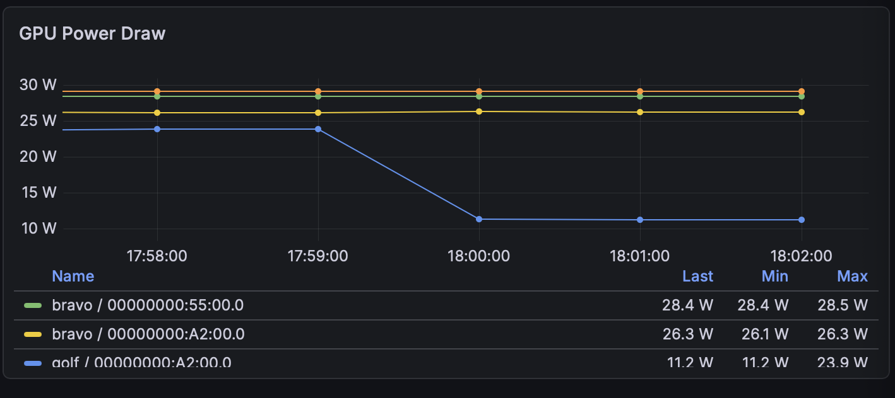
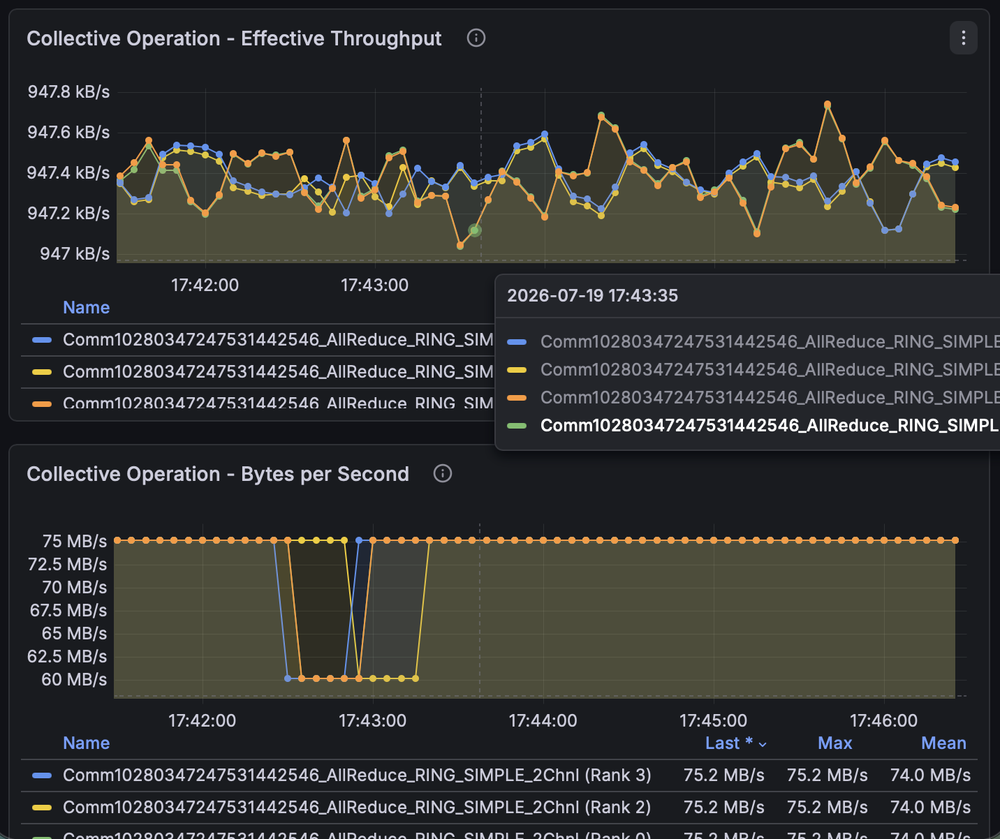
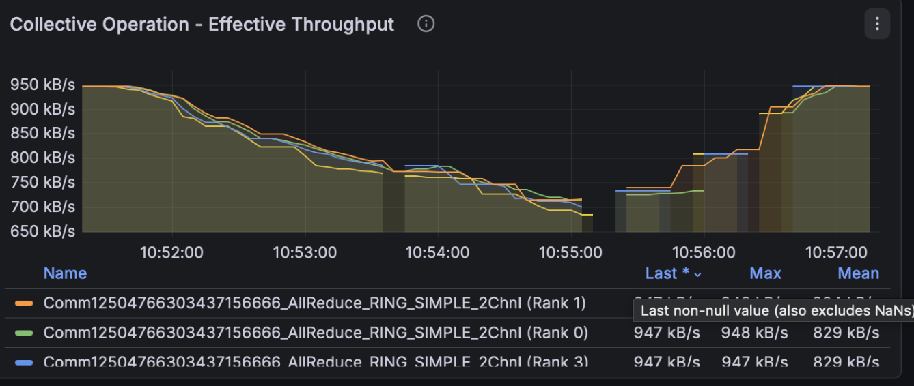
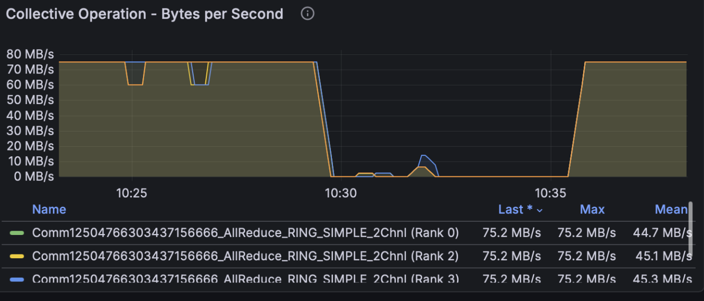
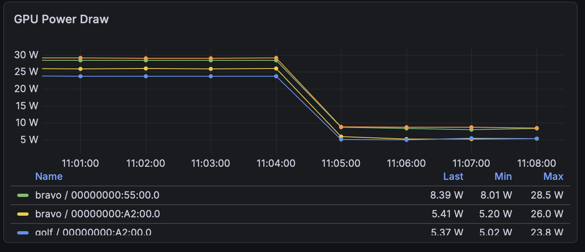
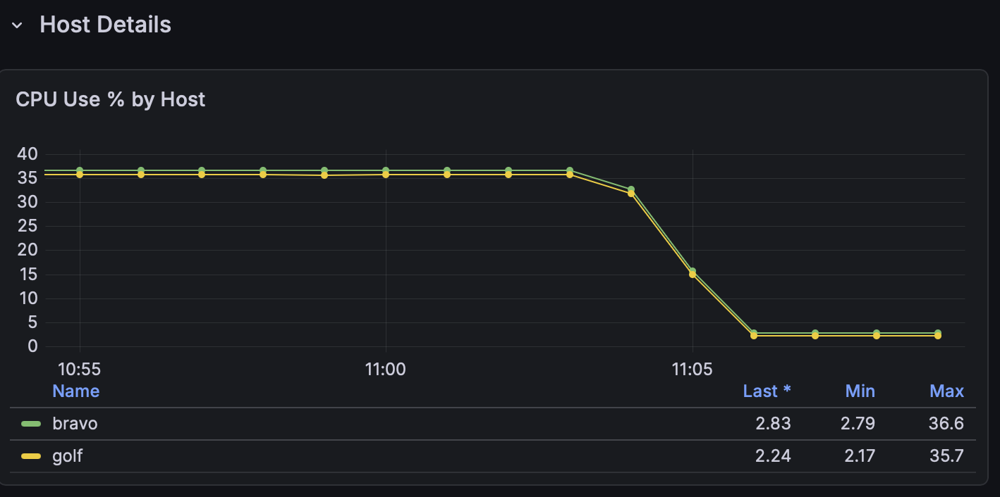
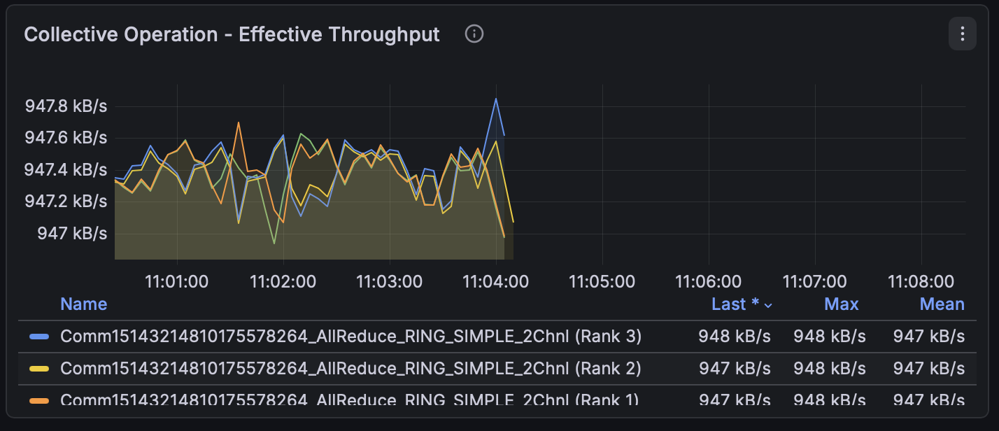
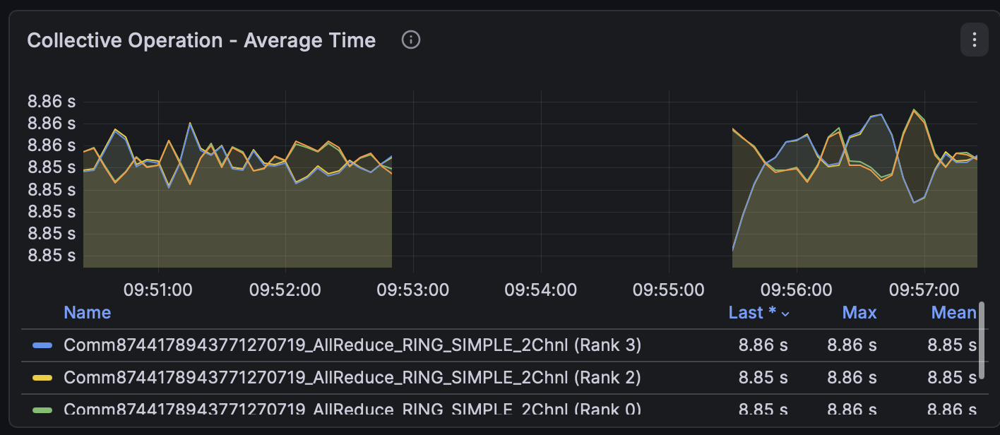
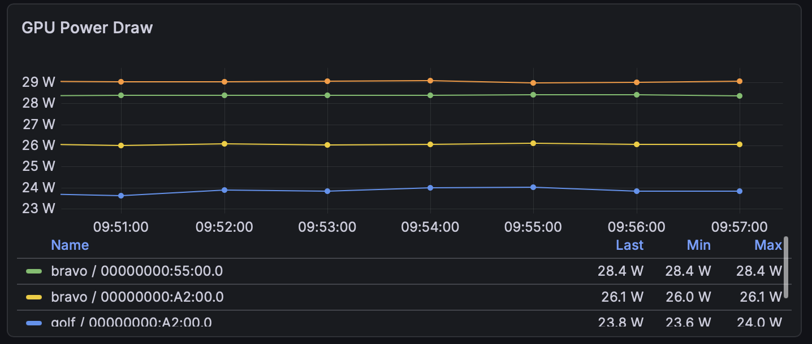

<!--
SPDX-FileCopyrightText: 2025 Delos Data Inc
SPDX-License-Identifier: Apache-2.0
-->

# Mosaic Fault Playbook

A fault-injection harness for the OpenMosaic profiler stack, plus a per-fault
reference: for each failure mode, the command that induces it, the metric
signature it produces, and how to recover. Every fault has a one-command inject
and an auto-restoring safety timer.

Advances issue #31 (failure paths beyond happy-path testing). The harness is
cluster-agnostic and reusable as an integration-test fixture.

Files:

| File | Purpose |
|---|---|
| `Makefile` | the harness — inject/restore/status targets (no site values in it) |
| `config.mk.example` | copy to `config.mk` and edit for your cluster |
| `FAULT_PLAYBOOK.md` | this document (setup, per-fault reference, gotchas) |
| `screenshots/` | reference Grafana captures |

---

## Quick start

```
cp config.mk.example config.mk     # edit for your cluster
make                               # help
make status                        # what's running / injected, per node
make workload                      # start your workload (see config.mk)

make inject-netem-loss PCT=1       # break something...
make restore                       # ...and undo it
```

Run `make` on the head node — it reaches the other nodes over SSH; nothing is
installed on the workers. Every inject arms an auto-restore timer
(`DEADMAN=<s>`, default 300; `0` disables).


## 1. What it does

The harness deliberately breaks a running multi-GPU collective workload in five
reproducible ways and lets you record how each one looks in Prometheus/Grafana:

| ID | Fault | Command |
|---|---|---|
| T2.2 | clamp one GPU's clock | `make inject-slow-gpu RANK=n` |
| T2.3 | network latency / loss | `make inject-netem-loss PCT=p` |
| T2.4 | kill one rank | `make inject-kill-rank RANK=n` |
| T2.5 | kill the OTel collector | `make inject-kill-collector` |
| — | undo everything | `make restore` |

The design goal is that a reviewer can reproduce any fault, on their own
cluster, from this document alone.

---

## 2. Prerequisites

Run the harness **on the head node** (the node you launch the workload from). It
reaches the other nodes over SSH, so nothing is installed on the workers — they
only receive commands. You need:

- **SSH key auth** from the head node to every node in `NODES`, including the
  head node to itself (the harness treats all nodes uniformly).
- **sudo** on every node for `tc` and `nvidia-smi`. Interactive sudo is enough:
  you are prompted once, at inject time, and the auto-restore timer inherits
  that privilege. For unattended/CI use, add NOPASSWD for just those two
  binaries, e.g. in `/etc/sudoers.d/`:
  ```
  <user> ALL=(root) NOPASSWD: /usr/sbin/tc, /usr/bin/nvidia-smi
  ```
- **docker access** on the collector host (to bounce the collector container).
- **`jq`** on the head node (for `make watch`).
- A **Prometheus + OTel-collector** deployment scraping the workload's profiler
  metrics and the node/GPU exporters.

---

## 3. Setup

```
cp config.mk.example config.mk     # then edit config.mk for your cluster
make                               # prints help; never launches anything
make status                        # ranks / qdisc / armed timers, per node
```

`config.mk` holds every site-specific value and is gitignored, so your topology
and paths never get committed. The `Makefile` itself contains no hostnames,
interfaces, or paths. Fill in, at minimum:

| Variable | Meaning |
|---|---|
| `NODES` | all nodes, space-separated |
| `IFACE` | the interconnect NIC on each node |
| `RANK_HOSTS` | `rank:node` map (which rank runs where) |
| `RANK_GPUS` | `rank:gpu-index` map (which local GPU each rank uses) |
| `COLLECTOR_HOST` / `COLLECTOR_CT` / `COLLECTOR_PROC` | collector node, container, process name |
| `PROM` | Prometheus base URL |
| `WORKLOAD_CMD` | how to launch your workload (see below) |

### The workload

`make workload` runs `WORKLOAD_CMD` (from `config.mk`) as one detached,
long-lived process. `config.mk.example` ships a reference launcher for
nccl-tests over TCP — **replace it with your own workload**. The fault targets
don't care what the workload is; they only use `WORKLOAD_PROC` to detect it.

Two rules the harness enforces, both of which matter for clean signatures:

- **Not a restart loop.** A loop rebuilds the NCCL communicator each iteration,
  resetting the profiler's two-window stabilization, so nothing exports. Use one
  long-lived process.
- **One job at a time.** `make workload` refuses to start a second concurrent
  job — two jobs share the link and emit series with identical `hostname`+`rank`
  labels that silently interleave.

### The safety timer ("deadman")

Every inject arms a timer that undoes the fault after `DEADMAN` seconds
(default 300). Because you reach each node over the same interface or GPU you're
degrading, this is what prevents a bad injection from stranding a node.

```
make inject-netem-loss PCT=1              # default 300s
make inject-netem-loss PCT=1 DEADMAN=600  # longer window (e.g. for screenshots)
make inject-netem-loss PCT=1 DEADMAN=0    # no timer; persists until `make restore`
```

---

## 4. Reading the metrics

### Trust the right metrics

Different profiler builds and interconnects expose different metrics reliably.
On any cluster, sanity-check a metric against an independent source (the kernel
NIC counter, DCGM) before trusting it. In particular, a per-rank *rate* metric
can be badly wrong if the transport reports completion early (e.g. TCP `send()`
returning at kernel handoff rather than delivery) — prefer a monotonic *bytes*
counter and derive the rate yourself.

To read the wire directly, independent of any exporter:

```
R1=$(cat /sys/class/net/<iface>/statistics/tx_bytes); sleep 10
R2=$(cat /sys/class/net/<iface>/statistics/tx_bytes)
echo "$(( (R2-R1)/10/1000000 )) MB/s on the wire"
```

Note that node-exporter, if run without host networking, reports only the
container's interfaces — not the host NIC — so `node_network_*` may not see your
interconnect at all.

### Rate queries alias — measure against a same-run baseline

`rate(<counter>[1m])` catches a whole number of scrape increments per window, so
consecutive reads can step by roughly one scrape's worth (often ~10%). **Treat
sub-10% moves as noise**, and measure a fault against a baseline captured *in the
same run*, not against a fixed number — steady-state throughput can vary run to
run.

### Know your cluster class

Which faults actually bite depends on what your workload is bound by:

| Bound by | `delay`/`loss` (T2.3) | GPU clamp (T2.2) |
|---|---|---|
| **network** (e.g. 1 GbE, large messages) | strong — this is the bottleneck | weak — GPU has slack, profiler shows nothing |
| **compute** | weaker | strong — throughput drops |
| **latency** (small messages, many collectives) | `delay` bites hard | varies |

The signatures below are described generically; the worked example in the
appendix shows concrete numbers for one (network-bound) cluster.

---

## 5. Faults

### T2.2 — GPU clock clamp

```
make inject-slow-gpu RANK=3 CLK=1500
```

Locks one GPU to `CLK` MHz (`nvidia-smi -lgc`). Resolves rank → GPU → PID so it
clamps exactly the target GPU.

**Signature — the only asymmetric fault.** Every other fault moves all ranks
together; this one hits a single GPU. On a network-bound workload it may not
move collective throughput at all (the clamped GPU still finishes its reduce
before the link is ready), in which case the signature lives **only in DCGM** —
that one GPU's `SM_CLOCK` / `POWER_USAGE` drops while the others hold. The
profiler-based signatures some designs predict (`rank_latency` / `collective_time`
divergence) may not appear; verify against DCGM.

**Near-binary — bisect `CLK`.** Clamp too hard and the collective times out and
the job aborts (looking like T2.4); too soft and nothing changes. Find the value
that throttles one GPU without killing the job by bisection.

*Screenshot — DCGM GPU Power (or SM_CLOCK): the clamped GPU drops while the others stay flat.*



*Screenshot — throughput: flat throughout (on a network-bound cluster). The profiler showing nothing is the point.*



**Recovery:** timer runs `nvidia-smi -rgc`; or `make restore`.

---

### T2.3 — Network latency / loss

```
make inject-netem-loss  PCT=1       # packet loss
make inject-netem-delay MS=20       # added latency
make inject-netem NETEM="loss 3%"   # arbitrary netem expression
```

Applies `tc netem` on `NODE`.

**Signature — symmetric degradation.** All ranks degrade together; network
faults are symmetric. The magnitude and whether the job survives are
cluster-dependent — on a bandwidth-bound cluster the usable band is narrow and
the response is close to binary (a small loss degrades; a larger one flatlines
the job). **Bisect to find the value that degrades without killing.**

**The `delay`-becomes-`loss` trap.** netem's default queue is `limit 1000`
packets. If the bandwidth-delay product exceeds that (tens of ms on a fast
link), the queue overflows and a `delay` fault silently turns into heavy packet
*loss*. Raise it explicitly if you want pure latency:
`make inject-netem NETEM="delay 50ms limit 5000"`.

**Localization is limited.** A pair-keyed byte metric (`source_rank`/`dest_rank`)
reveals the ring topology, but under netem all hops degrade together — a ring
all-reduce is bulk-synchronous, so one slow link gates every hop. A network
fault generally **cannot be localized to a node** from collective metrics alone.

*Screenshot — throughput under the fault: clear degradation, all ranks together, recovering after restore. (Use a full-scale panel so the drop is visible, not a zoomed one.)*



*Screenshot — past the cliff: a larger loss flatlines the job — indistinguishable from a dead job (contrast T2.4).*



**Recovery:** timer runs `tc qdisc del`; or `make restore`. **restore ≠
recovery** — after a heavy fault the job may take minutes to resume, or need a
restart.

---

### T2.4 — Kill a rank

```
make inject-kill-rank RANK=3
```

Resolves rank → GPU → UUID → PID, then `kill -9`. (It does **not** match the
workload binary with `pgrep -f` — the launcher's command line contains that
string too, so that would kill the launcher.)

**Signature — the whole job dies; the cluster goes idle.** NCCL has no fault
tolerance, so killing one rank aborts the entire job. All collectives flatline
at once **and** the machine idles: GPU power drops to its idle floor on every
GPU, host CPU use drops to near zero. The collector stays healthy
(`up{job="<collector>"}` = 1).

The signature is three independent instruments agreeing that the job stopped at
the same instant — no single panel is load-bearing, their agreement is:

*GPU power, all GPUs drop to idle*




*host CPU drops on every node*




*collective metrics stop when the job dies*




**Recovery:** not self-healing — `make workload`.

---

### T2.5 — Kill the OTel collector

```
make inject-kill-collector
```

`pkill -x <collector-proc>` from the host — **exact-name match, not `pkill -f`**,
which would also match a workload whose command line contains the collector's
name (e.g. `NCCL_PROFILER_PLUGIN=otel`). Kills only the collector process,
leaving Prometheus and Grafana (same container) alive, so the fault is
observable while it happens.

**Signature — metrics gap ≠ cluster failure.** The profiler series stop, but the
cluster is fine: `up{job="<collector>"}` → 0 while every other exporter stays 1,
the wire stays at line rate, and GPU power stays at its working level.

**This is the inverse of T2.4** — the distinction a diagnostic must learn:

| | metrics | `up{collector}` | GPU power |
|---|---|---|---|
| **T2.4** kill-rank | flatline | **1** (collector fine) | **idle** (job dead) |
| **T2.5** kill-collector | flatline | **0** (collector dead) | **working** (job alive) |

Same "metrics stopped" symptom; opposite everything else. GPU power alone
separates them.

*throughput series stop at the kill (the gap is the fault)*




*GPU power flat across the gap (cluster alive)*




**Recovery:** timer runs `docker restart <collector-ct>`; or `make restore`.
Metrics resume on their own once the collector is back. `docker restart`
preserves the TSDB (it lives in the container's writable layer); **`docker
compose down` destroys all collected metrics.**

---

## 6. Telling the faults apart

| Fault | Throughput | Ranks | GPU (DCGM) | `up{collector}` | Job survives? |
|---|---|---|---|---|---|
| T2.2 slow-gpu | usually unchanged | **one** GPU | one GPU clock/power **low** | 1 | yes |
| T2.3 netem | down (or 0) | all together | normal | 1 | depends on severity |
| T2.4 kill-rank | flatline | all together | **all** idle | 1 | no |
| T2.5 kill-collector | flatline | — | working | **0** | yes |

Decision order for a "collectives stopped" event:

1. `up{job="<collector>"}` = 0 → **T2.5** (collector died; cluster is fine).
2. Else all GPUs idle → **T2.4** (job died).
3. Else throughput down, GPUs busy, ranks uniform → **T2.3** (network).
4. Else one GPU's clock/power low while throughput holds → **T2.2**.

---

## 7. Gotchas

- **`pkill -f <collector>` can kill the workload** if the workload's command line
  contains the collector's name. Use `pkill -x`.
- **`pgrep -f <workload-binary>` also matches the launcher** (mpirun). Resolve
  rank → GPU → PID instead.
- **`up == 0` alone is not a health signal** — unused/misconfigured scrape
  targets are perpetually down. Key on the specific collector job.
- **restore ≠ recovery** — clearing a fault removes the cause; the job may still
  need minutes, or a restart, to recover.
- **`rate([1m])` aliases ~±10%.** Ignore sub-10% moves; baseline in the same run.
- **`docker compose down` wipes the TSDB.** Use `docker restart` to bounce the
  stack without losing history.
- **Don't run the workload as a restart loop** — it breaks the profiler's
  two-window stabilization and nothing exports.
- **A bare `make` prints help** and launches nothing; `make workload` refuses a
  second concurrent job.

---

## Appendix A — Worked example (2-node, 1 GbE, nccl-tests)

Concrete numbers from one deployment, to show what "correct" looks like. **Your
cluster will differ** — treat these as illustrative, not as thresholds.

**Setup:** 2 nodes × 2 GPUs, 1 GbE TCP interconnect (~0.28 ms RTT), nccl-tests
`all_reduce_perf` (8 MB messages) as the workload. This cluster is
**network-bound** — it runs pinned at ~98% of line rate, so GPUs idle at ~25 W
of a 70 W cap waiting on the wire.

**Baseline (T2.1):** ~78.8 MB/s per rank, four ranks uniform; ~122 MB/s on the
wire; reproducible to 4 s.f. across days. `rate([1m])` aliases between ~78.8 and
~71.7 MB/s (the ±10% noise floor).

**T2.2 GPU clamp:** `CLK=180` (the hardware minimum) starved the GPU so hard the
collective timed out and the job aborted; `CLK=1500` was clean — the clamped
GPU's power dropped ~24 W → ~11 W while the other three held at ~26–28 W, and
collective throughput stayed flat at ~75 MB/s. The fault was invisible in the
profiler and visible only in DCGM.

**T2.3 netem:** near-binary on this cluster. `delay 20ms` ≈ 6% (within noise);
`delay 50ms` collapsed the job (queue-overflow → loss). `loss 3%` flatlined it
(≈4 min recovery lag); `loss 0.5%` was erratic; **`loss 0.1%` gave a clean
~26% degradation** that recovered in ~1 min. All ranks moved together; per-pair
metrics showed no node localization.

**T2.4 kill-rank:** all collectives flatlined at once; GPU power dropped ~28 W →
~8 W on every GPU; host CPU dropped ~36% → ~2% on both nodes;
`up{job="otel-collector"}` stayed 1.

**T2.5 kill-collector:** profiler series stopped; `up{job="otel-collector"}`
→ 0 while gpu/node/process exporters stayed 1; wire stayed at ~122 MB/s; GPU
power stayed flat. Metrics resumed on their own after `docker restart`.

Example `config.mk` values for this cluster are in `config.mk.example`.
